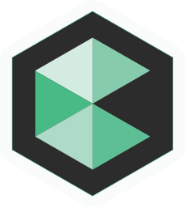

    
    <h3 align="center">Code2Create Website</h3>
    

        <em>Code2Create</em> is ACM-VIT’s flagship event and one of the grandest annual events hosted in VIT.
         
        <a href="https://c2c.acmvit.in/"><strong>Visit Us »</strong></a>
         
         
        <a href="https://github.com/ACM-VIT/c2c-website-2020/issues">Report Bug</a>
        ·
        <a href="https://github.com/ACM-VIT/c2c-website-2020/pulls">Pull Request</a>
    

## Table of Contents

-   [Design](#design)
-   [Contributing](#contributing)
-   [License](#license)

## Design

The design is available over [here](https://xd.adobe.com/view/e4b2599c-2633-4ee2-7675-c7fd5b668eb5-9283/ "c2c design"); consult the slack channel for any enquires.

## Contributing

Pull requests are welcome. For major changes, please open an issue first to discuss what you would like to change.

## License
 
Distributed under the MIT License. See `LICENSE` for more information.
